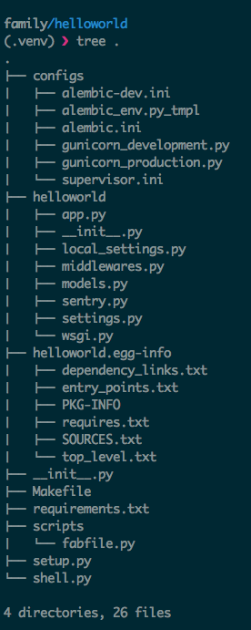

# We are family, we are microservices

## Get Started

### Why family ?

    * Integrate alternative web frameworks, fabric, supervisor, gunicorn and server configuration files.
    * Almost include all of 12 factors.

### Installation

    pip install family

### Create your app

    family-createapp -f falcon helloworld

    # project structure looks like this.

### Initialize

    make init

### Alternative framework

    family-createapp -f flask helloworld

### Local development

    make start
    

## TODO

    * service discover
    * trace logger
